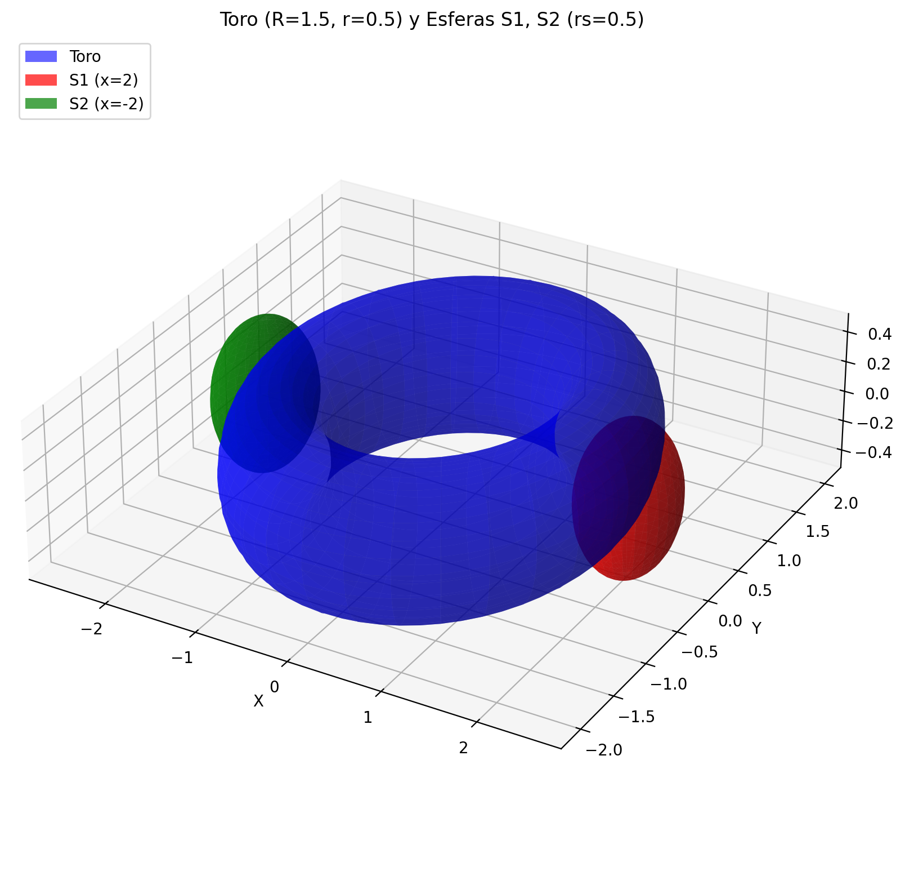
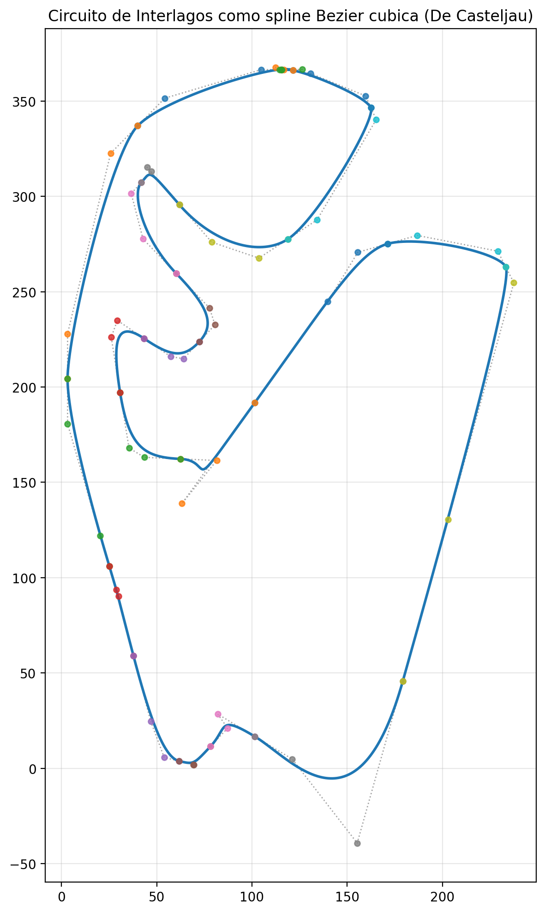
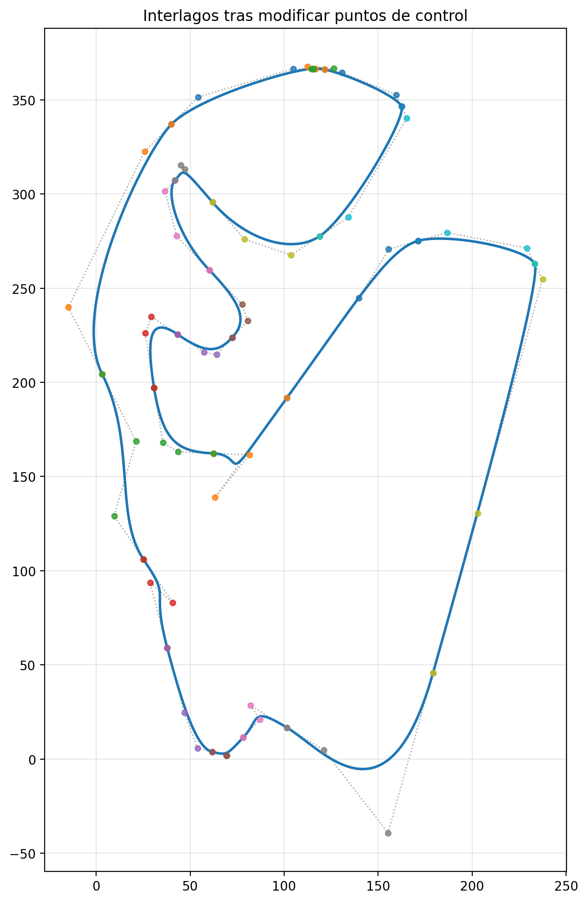
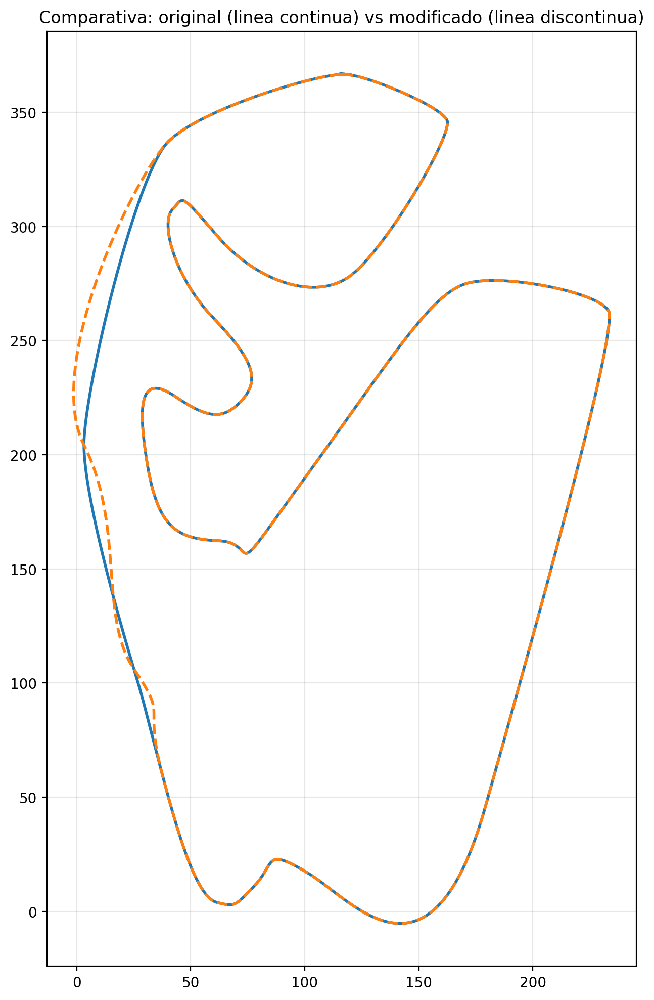

# Informe

## Datos del grupo

- Integrante 1: Pablo Ulloa Santín            - pablo.ulloa.santin@udc.es
- Integrante 2: Pablo Méndez Vázquez          - p.mendez.vazquez@udc.es
- Integrante 3: Francisco Javier Espada Radío - j.espada@udc.es

Se entrega este informe junto con el codigo fuente `ex1.py` y `ex2.py`.

Se ejecutan los scripts `ex1.py` (Ejercicio 1) y `ex2.py` (Ejercicio 2) con los comandos:

```bash
python ex1.py --output-dir outputs
python ex2.py --output-dir outputs
```

## Ejercicio 1 - Monte Carlo para toro y esferas

En este ejercicio se estima por Monte Carlo el volumen de un toroide, el de dos esferas, el de las intersecciones toro-esfera y el de la union de los tres solidos.

### Como se generan los puntos aleatorios

Se trabaja dentro de la caja contenedora `[-3, 3] x [-3, 3] x [-3, 3]`, cuyo volumen es `V_caja = 216`. Para generar puntos uniformes en esa caja, se toman `x`, `y` y `z` de manera independiente con distribucion uniforme en el intervalo `[-3, 3]`. Cada muestra genera por tanto un punto aleatorio del espacio con igual probabilidad en cualquier posicion de la caja.

Una vez generado cada punto, se comprueba si pertenece:
- al toro `T`,
- a la esfera derecha `S1`,
- a la esfera izquierda `S2`,
- a las intersecciones `T inter S1` y `T inter S2`,
- y a la union `T union S1 union S2`.

El volumen de cada conjunto se estima como:

`V_hat = V_caja * (numero de puntos dentro del conjunto / N)`

donde `N` es el numero total de puntos generados.

### Como se hizo el calculo

Para decidir si un punto pertenece al toro se usa la forma algebraica equivalente:

`(x^2 + y^2 + z^2 + R^2 - r^2)^2 <= 4 R^2 (x^2 + y^2)`

con `R = 1.5` y `r = 0.5`.

Para las esferas se usan las ecuaciones:
- `S1`: centro `(2, 0, 0)` y radio `0.5`
- `S2`: centro `(-2, 0, 0)` y radio `0.5`

Tambien se calcula:
- la interseccion `T inter S1`,
- la interseccion `T inter S2`,
- la union `T union S1 union S2`.

Ademas, para el toro y las esferas se comparan las estimaciones con los valores exactos:
- toro: `V_T = 2 pi^2 R r^2`
- esfera: `V_S = (4/3) pi r_s^3`

### Output completo de `ex1.py`

```text
Resultados Monte Carlo:
               objeto    V_hat   V_exact      N  box  V_box   abs_error   rel_error          SE  CI95_low  CI95_high
   T (toroide solido)   7.4142    7.4022 600000 cube    216   0.0119967  0.00162069    0.050769   7.31469    7.51371
  S1 (esfera derecha)  0.50256  0.523599 600000 cube    216   0.0210388   0.0401811   0.0134351  0.476227   0.528893
S2 (esfera izquierda)  0.52596  0.523599 600000 cube    216  0.00236122  0.00450961   0.0137435  0.499023   0.552897
           T inter S1  0.20016       NaN 600000 cube    216         NaN         NaN  0.00848474   0.18353    0.21679
           T inter S2  0.19908       NaN 600000 cube    216         NaN         NaN  0.00846184  0.182495   0.215665
  T union S1 union S2  8.04348       NaN 600000 cube    216         NaN         NaN   0.0527998   7.93999    8.14697

Comprobaciones de consistencia:
VS1 - VS2 = -0.0234
V(T inter S1) - V(T inter S2) =  0.00108
Vunion - (VT + VS1 + VS2 - V(T inter S1) - V(T inter S2)) =  0
Vunion - (VT + 2VS - 2Vinters) =  0
```

### Explicacion de los resultados

- `T (toroide solido)`: el volumen estimado es `7.4142`, muy proximo al valor exacto `7.4022`. El error relativo es `0.16%`, asi que la estimacion es muy buena.
- `S1 (esfera derecha)`: el volumen estimado es `0.50256`, frente al valor exacto `0.523599`. La diferencia es pequena y compatible con el error muestral.
- `S2 (esfera izquierda)`: el volumen estimado es `0.52596`, tambien muy cercano a `0.523599`.
- `T inter S1` y `T inter S2`: las dos intersecciones se estiman como `0.20016` y `0.19908`. Son practicamente iguales, lo que confirma numericamente la simetria esperada.
- `T union S1 union S2`: la union total de los tres solidos se estima en `8.04348`.

Las columnas de la tabla significan:
- `V_hat`: volumen estimado por Monte Carlo.
- `V_exact`: volumen exacto cuando se conoce.
- `abs_error`: error absoluto `|V_hat - V_exact|`.
- `rel_error`: error relativo absoluto.
- `SE`: error estandar del estimador.
- `CI95_low` y `CI95_high`: extremos del intervalo de confianza aproximado del 95%.

### Comprobaciones de consistencia

Las lineas finales sirven para verificar que el resultado es coherente:

- `VS1 - VS2 = -0.0234`: las dos esferas tienen practicamente el mismo volumen estimado, como debe ocurrir por simetria.
- `V(T inter S1) - V(T inter S2) = 0.00108`: las dos intersecciones tambien son practicamente iguales.
- `Vunion - (VT + VS1 + VS2 - V(T inter S1) - V(T inter S2)) = 0`: se cumple exactamente la formula de inclusion-exclusion con las estimaciones obtenidas.
- `Vunion - (VT + 2VS - 2Vinters) = 0`: tambien se cumple la version simplificada aprovechando la simetria entre las esferas.

Estas dos igualdades confirman que las mascaras logicas usadas en el codigo para intersecciones y union son consistentes entre si.



En esta imagen se representa la geometria del problema del ejercicio 1. Se ve el toroide centrado en el origen y las dos esferas colocadas de forma simetrica a ambos lados del eje `x`. La imagen no muestra la nube de puntos del Monte Carlo, sino los solidos cuya pertenencia se comprueba en cada muestra. Esta visualizacion ayuda a entender por que las dos intersecciones y los dos volumenes esfericos deben ser muy parecidos.

## Ejercicio 2 - Curvas de Bezier para una figura 2D

En este ejercicio se dibuja una figura 2D mediante un spline a trozos formado por curvas de Bezier cubica. La figura utilizada es el contorno del circuito de Interlagos.

### Figura utilizada

Se toma como figura 2D el trazado cerrado del circuito de Interlagos. El contorno base se define directamente en el codigo mediante una lista de tramos Bezier cubicos.

### Trazos y puntos de control

La figura se descompone en `23` tramos de Bezier cubica. Cada tramo se define con `4` puntos de control, porque una curva de Bezier de grado `3` usa `n + 1 = 4` puntos:
- `P0`: punto inicial,
- `C1`: primer punto de control,
- `C2`: segundo punto de control,
- `P3`: punto final.

El conjunto de todos los tramos reconstruye el contorno completo del circuito.

### Formula y evaluacion

Para cada tramo se usa la formula de Bezier cubica

`B(t) = (1 - t)^3 P0 + 3 (1 - t)^2 t C1 + 3 (1 - t) t^2 C2 + t^3 P3`, con `t` en `[0, 1]`.

En el codigo, esta evaluacion se realiza mediante una implementacion recursiva del algoritmo de De Casteljau. El trazado base se almacena en `SUBPATH_1_CUBICS`. Despues, se muestrean muchos puntos de cada tramo y se unen para dibujar el contorno completo con Matplotlib.

### Continuidad entre tramos

La continuidad se comprueba y se fuerza explicitamente en el codigo. Primero se verifica continuidad posicional (`C0`): el punto final de cada tramo coincide con el punto inicial del siguiente. Despues se ajustan los puntos de control interiores en cada union para igualar las derivadas laterales e imponer continuidad de primera derivada (`C1`).

Para una union entre dos cubicas consecutivas, se toma el vector de salida del tramo anterior y el vector de entrada del tramo siguiente, y se sustituye ambos por su promedio. Asi, si `P` es el punto comun, se actualizan los handles para que el vector `P - C2` del tramo anterior coincida con el vector `C1 - P` del siguiente. De este modo, la tangente a ambos lados de la union pasa a ser la misma.

El trazado final queda conectado y con continuidad tangencial entre todos los tramos.

### Elementos dibujados

En las figuras se muestran:
- la curva resultante,
- los puntos de control de cada tramo,
- y las rectas del poligono de control, incluidas las que unen los puntos proximos a los extremos de tramos consecutivos.

### Modificacion de puntos de control

Para comprobar el efecto de la modificacion de los puntos de control se genera:
- una version original del circuito,
- una version modificada,
- y una comparativa superpuesta.

En la modificacion se altera el tercer segmento del trazado principal (`segment_idx = 2`). Se desplaza uno de sus puntos de control interiores con `delta = (18.0, -12.0)` y el otro se ajusta con el desplazamiento opuesto escalado (`-0.6 * delta`). A continuacion, el codigo reajusta automaticamente los handles de los segmentos vecino anterior y vecino posterior para conservar la misma derivada en ambos empalmes.

### Imagenes generadas



Esta primera imagen muestra el circuito reconstruido mediante `23` tramos de Bezier cubica ajustados para cumplir continuidad `C1`. Los puntos visibles son los puntos de control y las lineas punteadas grises forman el poligono de control.



En esta segunda imagen se ve el mismo circuito tras modificar un tramo concreto del spline. Se mueven dos puntos de control interiores del tercer segmento y se reajustan los handles de los segmentos vecinos para preservar la continuidad `C1` en ambos empalmes.



La tercera imagen superpone la curva original y la curva modificada. En esta comparacion la curva original se dibuja con linea continua y la modificada con linea discontinua. Ese estilo de trazado solo sirve para distinguir visualmente ambas curvas y no indica una discontinuidad geometrica.
